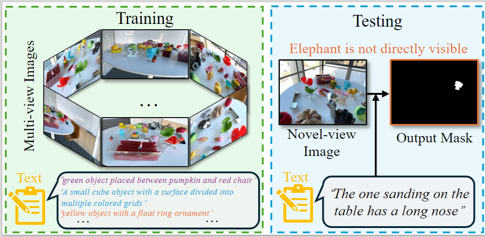

<p align="center">
  <h1 align="center">ReferSplat: Referring Segmentation in 3D Gaussian Splatting</h1>
  <p align="center">
    ICML 2025 Oral
  </p>
 <p align="center">
    <a href="https://arxiv.org/abs/2508.08252">
      
    </a>
  </p>

## Abstract
We introduce Referring 3D Gaussian Splatting
Segmentation (R3DGS), a new task that focuses
on segmenting target objects in a 3D Gaussian
scene based on natural language descriptions.
This task requires the model to identify newly
described objects that may be occluded or not
directly visible in a novel view, posing a significant challenge for 3D multi-modal understanding. Developing this capability is crucial for advancing embodied AI. To support research in this
area, we construct the first R3DGS dataset, **Ref-LERF**. Our analysis reveals that 3D multi-modal
understanding and spatial relationship modeling
are key challenges for R3DGS. To address these
challenges, we propose **ReferSplat**, a framework
that explicitly models 3D Gaussian points with
natural language expressions in a spatially aware
paradigm. ReferSplat achieves state-of-the-art
performance on both the newly proposed R3DGS
task and 3D open-vocabulary segmentation benchmarks. Code, trained models, and the dataset will
be publicly released.

## Datasets
The **Ref-LERF dataset** is accessible for download via the following link: [baiduyun](https://pan.baidu.com/s/1D9yDNfUrK-d8eGO33Avkpg?pwd=ugs3) or [huggingface](https://huggingface.co/datasets/FudanCVL/Ref-Lerf)
```bash
<path to ref-lerf dataset>
|---figurines
|---ramen
|---waldo_kitchen
|---teatime
```
Each scene contains a `mask/` directory (test-only ground-truth masks) and a `gt_mask/` directory (covering all frames). The dataset loader automatically falls back to `mask/` when `gt_mask/` is absent.
## Checkpoints and Pseudo mask

The **Checkpoints and Pseudo mask** are accessible for download via the following link:[googledrive](https://drive.google.com/drive/folders/1z9O2FWwUlE29lSgLDj9Af7sv5ZQv6sc_?usp=sharing) or [huggingface](https://huggingface.co/FudanCVL/RefSplat)

## Cloning the Repository
The repository contains submodules, thus please check it out with
```bash
#SSH
git clone git@github.com:heshuting555/ReferSplat.git
cd ReferSplat
```
or
```bash
#HTTPS
git clone https://github.com/heshuting555/ReferSplat.git
cd ReferSplat
```
## Setup
Our default, provided install method is based on Conda package and environment management:
```bash
conda env create --file environment.yml
conda activate refsplat
```
## Training
Note: Before training, you need to train original [3DGS](https://github.com/graphdeco-inria/gaussian-splatting) to obtain pretrained Gaussians for RGB rendering. Pass that pretrained checkpoint via `--start_checkpoint`; it is required.

```bash
# <path to scene> is e.g. <ref-lerf>/ramen
python train.py \
    -s <path to scene> \
    -m <path to output_model> \
    --start_checkpoint <path to scene>/<scene>chkpnt30000.pth
```

Training runs for `--total_iters` iterations (default `45000`, matching the paper) and saves 10 evenly-spaced checkpoints named `chkpnt_cbasetea251{0..9}.pth`.

## Fisher UC + Classifier Head

This fork includes the Fisher uncertainty plus present/absent classifier code used for no-target Ref-LERF experiments. See `docs/fisher_uc_classifier.md`.

The shortest entry point is:

```bash
bash scripts/run_fisher_uc_attrconv_pipeline.sh \
    --scene ramen \
    --source /data1/shuting/audioRef/ramen \
    --baseline-model /data1/shuting/audioRef/output/ramen_baseline_v2 \
    --checkpoint chkpnt_cbasetea2519.pth \
    --output-root /data1/shuting/audioRef/output \
    --gpu 0
```

It computes per-Gaussian RGB/color Fisher uncertainty, loads it with `--external_gaussian_uncertainty_path`, and trains `GaussianAttrConvPoolFormerHead + PresentHead` with `--present_head_only`.

Directory layout:
```bash
<ref-lerf>
|---<path to ref-lerf dataset>
|   |---<figurines>
|   |---<ramen>
|   |---...
|---<path to output_model>
    |---<figurines>
    |---<ramen>
    |---...
```

## Render
```bash
python render.py \
    -m <path to output_model> \
    --include_feature \
    --skip_train \
    --checkpoint_name chkpnt_cbasetea2519.pth \
    --iteration 9
```
`--checkpoint_name` selects which saved milestone to render; `--iteration` is the integer suffix used to organize the output folder under `<output_model>/testccc/ours_<iteration>/`.

## Evaluation
After rendering, compute mIoU between the predicted and ground-truth masks:
```bash
python test_miou.py \
    --render_dir <path to output_model>/testccc/ours_<N>/renders \
    --gt_dir     <path to output_model>/testccc/ours_<N>/gt
```
Sweep `<N>` across all saved milestones (`0..9`) and report the best mIoU.

## Get pseudo mask
```bash
Please refer to the "Grounded-SAM: Detect and Segment Everything with Text Prompt" method in https://github.com/IDEA-Research/Grounded-Segment-Anything
```


## BibTeX
Please consider citing ReferSplat if it helps your research.

```bibtex
@inproceedings{ReferSplat,
  title={{ReferSplat}: Referring Segmentation in 3D Gaussian Splatting},
  author={He, Shuting and Jie, Guangquan and Wang, Changshuo and Zhou, Yun and Hu, Shuming and Li, Guanbin and Ding, Henghui},
  booktitle={International Conference on Machine Learning (ICML)}
}
```
